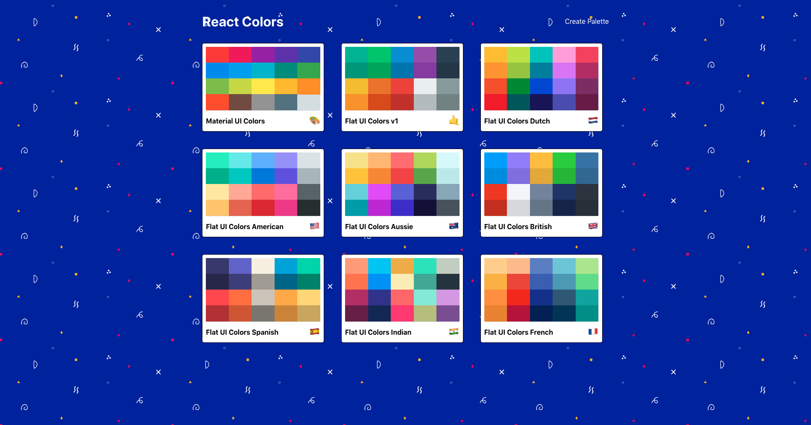
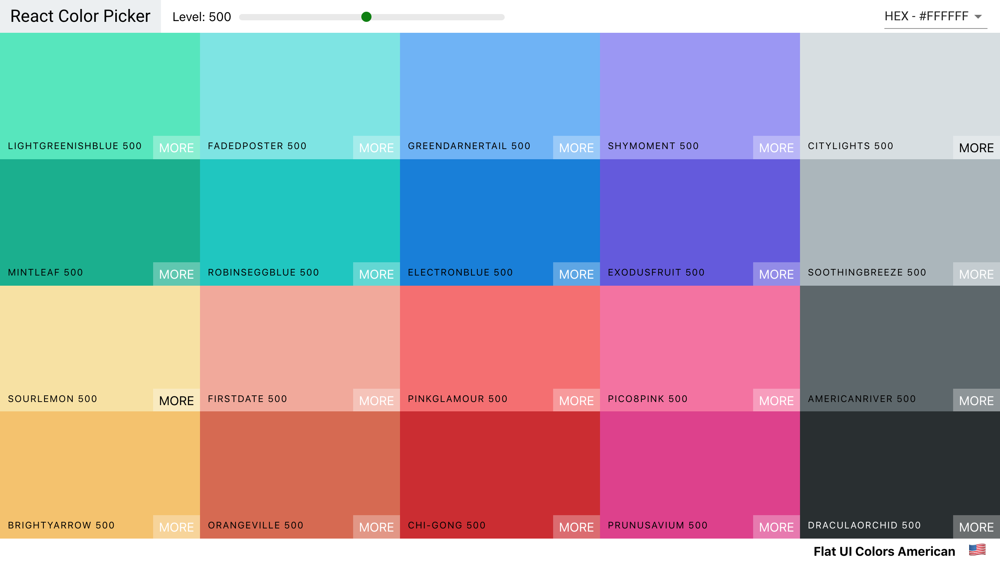
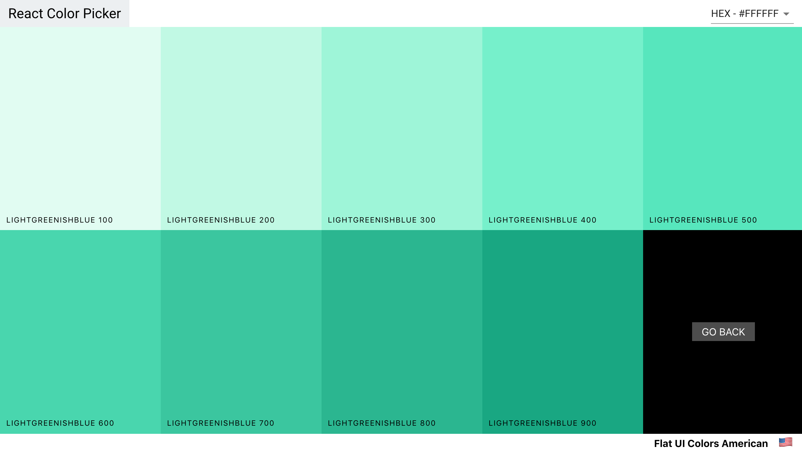
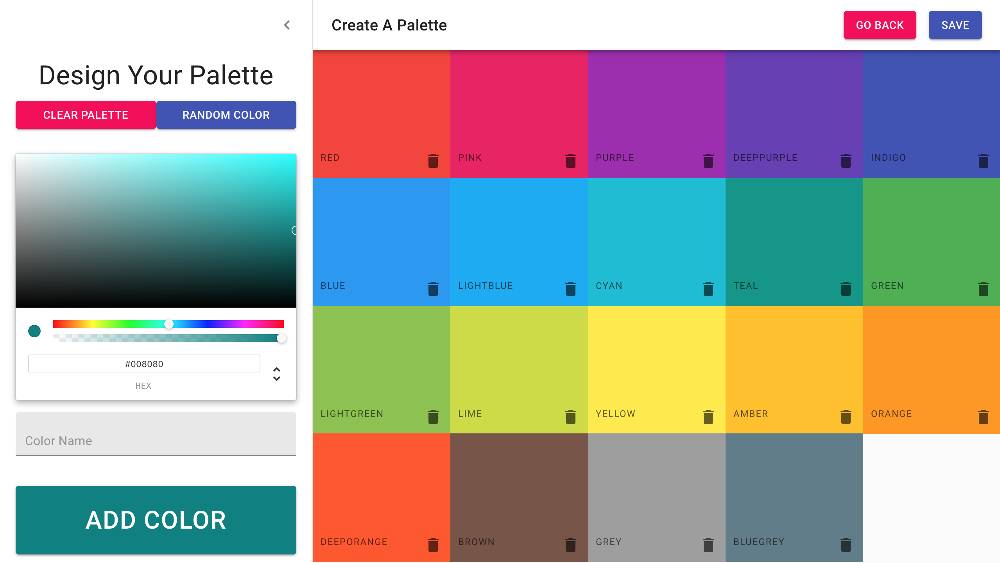

# Color Palettes App

This is the capstone project of The Modern React Bootcamp course on Udemy. It utilizes several libraries and frameworks to create a responsive and modern app. 

<a href="https://ricardo-gonzalez-villegas.github.io/react-color-app/">View it here.</a>
<section>
<h2>Technologies Used<h2/>
HTML, CSS, Javascript, React 
</section>

 
 
 
  Material UI 
  https://material-ui.com/
 

  
 
  Chroma JS  
  https://gka.github.io/chroma.js/
 

 

 Emojis 
 https://github.com/missive/emoji-mart
 

  
 
  RC Slider 
  https://github.com/schrodinger/rc-slider
 

 
 
  Copy To Clipboard 
 https://www.npmjs.com/package/react-copy-to-clipboard
 

  
 
  Copy To Clipboard 
 https://www.npmjs.com/package/react-copy-to-clipboard
 

  
 
  React Router 
 https://reacttraining.com/react-router/web/guides/quick-start
 

  
 
  React Sortable Higher Order Components 
 https://github.com/clauderic/react-sortable-hoc
 

 
 
  Color Picker 
  https://casesandberg.github.io/react-color/
 

 
<h1>Home Page</h1>

<h1>Palette</h1>

<h1>Subpalette</h1>

<h1>Copying Color</h1>

<h1>Creating Palette</h1>

<h1>Drag & Drop</h1>

